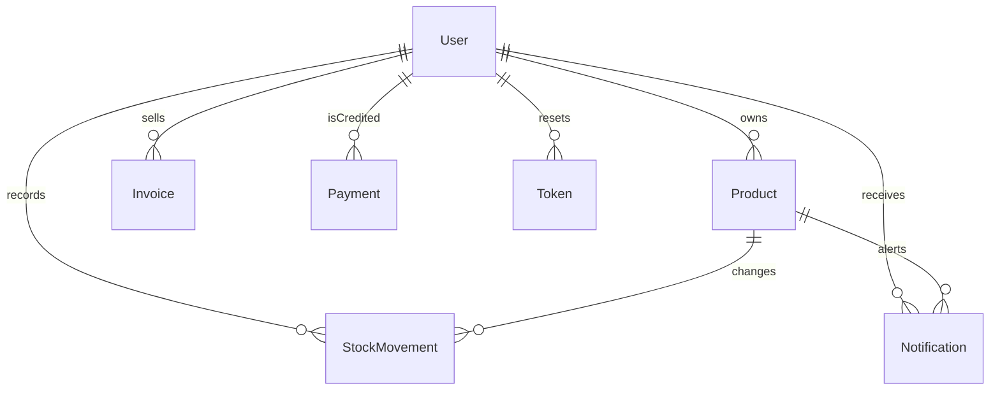

# Architecture

```text
Browser  -->  frontend nginx :8080  -->  backend Express :5000  -->  MongoDB
                      |                         |
                      |                         +--> uploads volume (or Cloudinary)
                      +--> static React build
```

The published port is `8080`. MongoDB is not published to the host. Nginx proxies `/api/` and `/uploads/` to the API container and serves every other path from the React build, including client-side routes.

## Authentication

Register and login set an httpOnly cookie named `token`. The JWT expires in one day (`expiresIn: "1d"`). The cookie flags come from `COOKIE_SECURE`:

- `false` (Compose default): `Secure` is off and `SameSite` is `Lax`, so the cookie is stored on `http://localhost`.
- `true`: `Secure` is on and `SameSite` is `None`, for an HTTPS frontend on another site.

Protected routes read `req.cookies.token` and load the user. A failed login does not set the cookie.

Shop access is separate from login. A user with `role: "admin"` always has access. Any other account has access while `paidUntil` is in the future, or while `trialEndsAt` is in the future. `trialEndsAt` is 30 days after registration. Accounts created before that field existed receive a trial end of 30 days after `createdAt` the next time they are loaded. When access has ended, inventory, scan, report, notification, and contact routes return 403 `Account access is paused`. Login, logout, and profile still work, and the React app shows `/blocked`.

Password reset stores a SHA-256 hash of a random token in the `Token` collection. The raw token is emailed as `${FRONTEND_URL}/resetpassword/:resetToken` and expires after 30 minutes. The reset token is not written to the server log. If SMTP is not configured, the route returns 503 and does not create a reset token.

## Records



Invoice lines are stored inside the invoice, not as their own collection. A payment points at the shop user and at the operator who recorded it.

`User`: name, unique email, bcrypt password, photo, phone, bio, `role` (`user` or `admin`), `trialEndsAt`, `paidUntil`.

`Product`: owner user id, name, sku, category, quantity, price, cost, reorder level (default 5), description, benefits, use cases, image object, timestamps. Quantity, price, cost, and reorder level are numbers. Benefits and use cases are optional rich text. The image object has `fileName`, `filePath`, `fileType`, and `fileSize`. `filePath` is `/uploads/<filename>` on disk, or a Cloudinary URL when Cloudinary credentials are set. Each user can list, read, update, and delete only their own products.

`StockMovement`: owner, product, product name, sku, type (`restock`, `checkout`, or `adjustment`), quantity change, quantity after, unit price, unit cost, note. Editing a product quantity writes an `adjustment`.

`Invoice`: owner, number `INV-<timestamp>`, line snapshots (product, name, sku, quantity, unit price, unit cost), subtotal, cost total, profit, note.

`Notification`: owner, product, type (`low_stock` or `out_of_stock`), title, body, `read`. One unread notification of each type is kept per product. A later drop below the reorder level can create another after the earlier one is read or cleared, or after quantity has gone back above the level and an unread one of that type is gone.

`Payment`: shop user, months credited, optional amount, note, the admin who recorded it, and the resulting `paidUntil`. This is a record of an offline payment. The app does not charge a card.

`Token`: user id, hashed reset token, `createdAt`, `expiresAt`. This collection is for password reset, not for the session.

## Images and QR

Multer writes the upload into `backend/uploads` (the `uploads_data` volume in Compose). If `CLOUDINARY_CLOUD_NAME`, `CLOUDINARY_API_KEY`, and `CLOUDINARY_API_SECRET` are all set, the API then uploads that file to Cloudinary and stores the remote URL. Otherwise the browser loads the file through `/uploads/...`.

Profile photos use `POST /api/users/photo` and the same storage path. The default avatar is a placeholder image URL on the user document.

Product detail draws a QR code whose text is `${origin}/scan/<productId>`. The scan page reads that code with the device camera, or the user searches the product list. Restock and checkout call the API, which checks the owner and the subscription. The QR code is an identifier, not a secret.

## Email

Nodemailer sends password-reset and Report Bug messages when `EMAIL_HOST`, `EMAIL_USER`, and `EMAIL_PASS` are all set. Report Bug requires a logged-in shop with access and sends the message to `EMAIL_USER`. Stock alerts are always stored for the bell. The same text is emailed to the shop only when SMTP is configured. A failed alert email does not undo the stock change. Forgot-password and Report Bug, when SMTP is unset, respond with 503 and the message `Email services aren't available`.

## Admin

On startup, if `ADMIN_EMAIL` and `ADMIN_PASSWORD` are set, the API creates that user with `role: "admin"` when the email is missing. If the email already exists, it is marked admin and the password is left as stored. Compose defaults are for local use only. Replace them before offering the stack as a service. Backup and restore of MongoDB and the uploads volume are described in [operations.md](operations.md).
