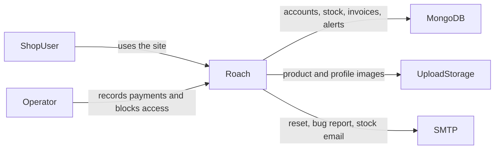
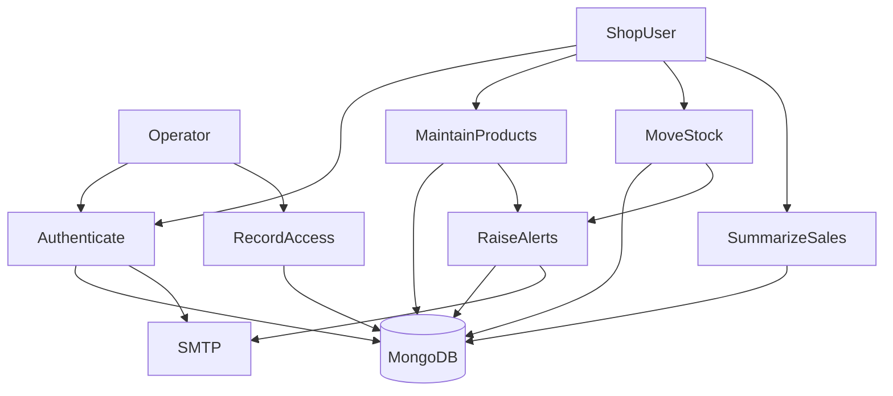
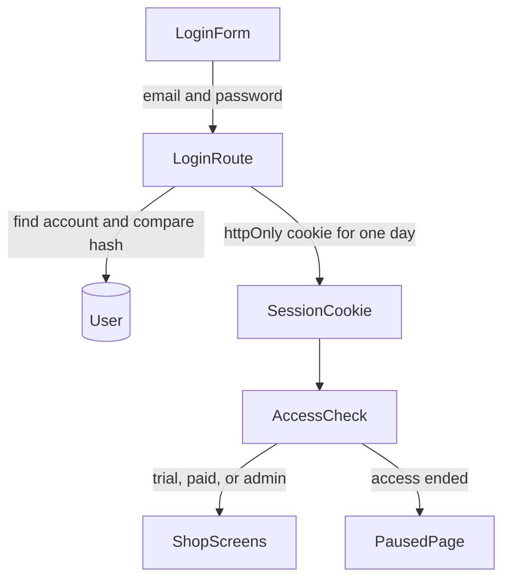
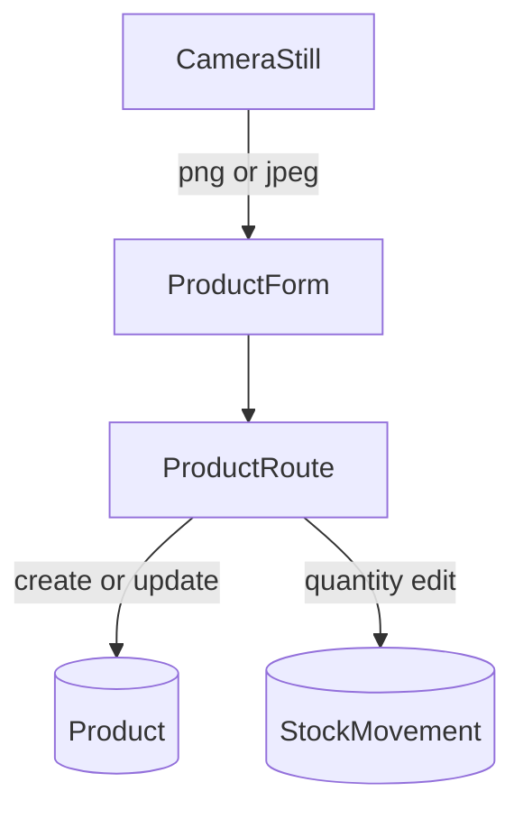
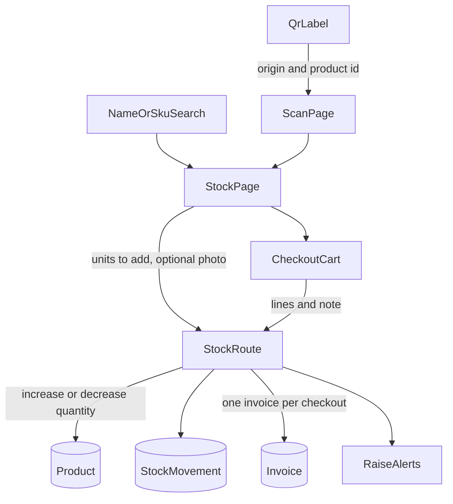
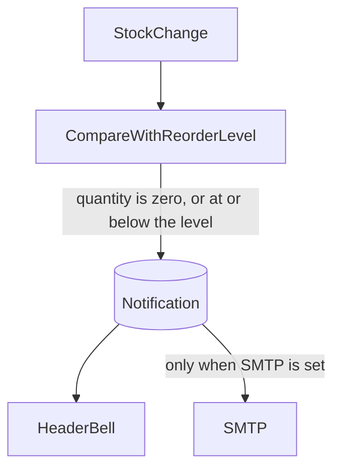
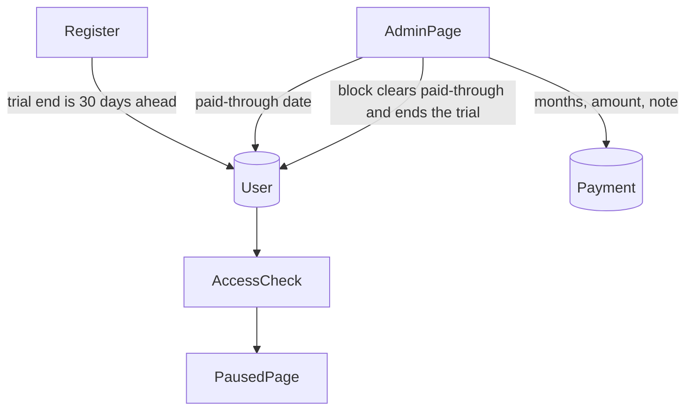

# Data flow

These diagrams match the running system. A shop only reads and writes its own records. The operator is the admin account for this deployment. SMTP is used only when `EMAIL_HOST`, `EMAIL_USER`, and `EMAIL_PASS` are all set.

## Context

Upload storage is the `uploads_data` volume, or Cloudinary when all three Cloudinary variables are set.

## Level 1

Paused shops still pass Authenticate. Maintain products, move stock, read reports, read alerts, and Report Bug stop until Record access extends them.

## Sign in and session

Register writes the user, sets the trial end to 30 days ahead, and sets the same cookie. Logout clears the cookie. Forgot password, when SMTP is configured, stores only a hash of the reset token and emails the raw token. The link expires after 30 minutes.

## Product and stock

Quantity on the edit form is an adjustment. Create and update also ask the alert step to look at the new quantity.

## Scan, restock, and checkout

The QR text is the site origin plus `/scan/` and the product id. The scan page can ignore the camera and open the same stock page from search. Checkout refuses a line whose quantity is greater than the quantity on hand. The cart itself is kept in the browser until the sale is confirmed.

## Alerts

One unread notification of each type is kept per product. Opening an item marks it read. Read all marks the shop's list read. Clear all deletes that list. A failed email does not remove the bell item and does not undo the stock change.

## Access and payment

The paid-through date is the chosen number of months after the later of today, the current paid-through date, and the trial end. Block does not delete products, invoices, movements, notifications, or files. The operator account is not blocked and does not expire.
